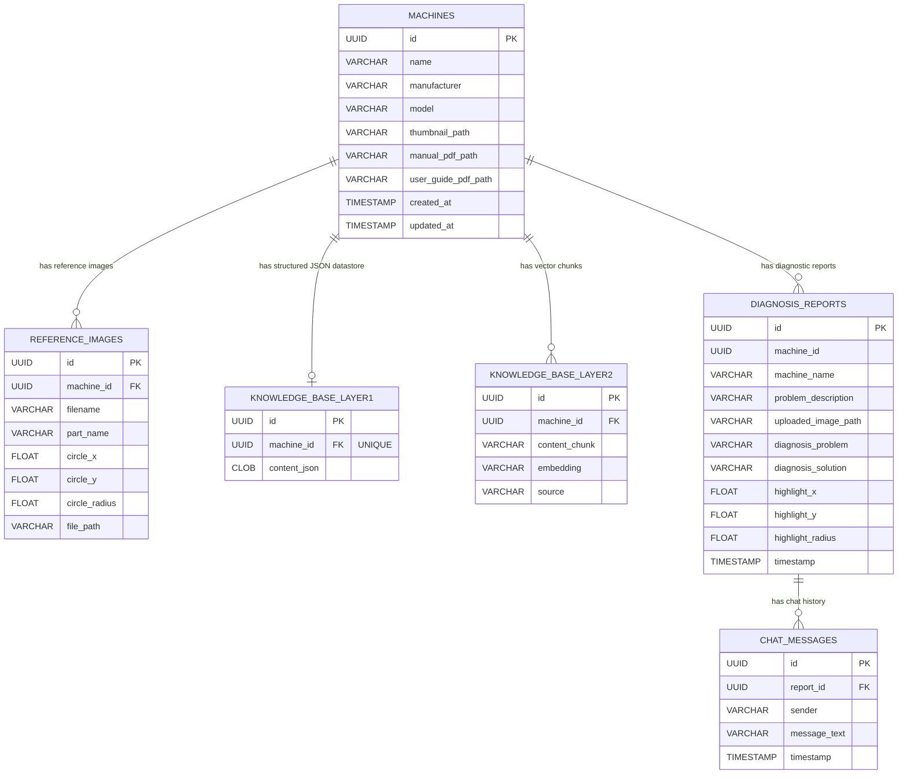

# VisionTwin AI - Database Architecture & Schema Documentation

This document provides a comprehensive overview of the database structure, entity-relationship diagrams, table schemas, data types, converters, and relationships used in the **VisionTwin AI** backend system.

---

## 1. Overview & Technology Stack

- **Database Engine:** H2 Database (File-based mode stored at `./data/visiontwin`)
- **ORM / Persistence:** Spring Data JPA / Jakarta Persistence API (Hibernate)
- **Database Dialect:** `org.hibernate.dialect.H2Dialect`
- **Primary Key Strategy:** UUID (`GenerationType.UUID`)
- **Schema Management:** Hibernate DDL Auto (`ddl-auto: update`)

---

## 2. Entity Relationship Diagram (ERD)

---

## 3. Table Schemas

### 3.1. `machines`
Stores industrial machinery records along with references to manual PDFs, user guides, and thumbnails.

| Column Name | Java Data Type | SQL / H2 Type | Constraints | Description |
|---|---|---|---|---|
| `id` | `UUID` | `UUID` | `PRIMARY KEY` | Unique identifier generated as UUID. |
| `name` | `String` | `VARCHAR(255)` | `NOT NULL` | Name of the machine (e.g. "CNC Lathe Machine"). |
| `manufacturer` | `String` | `VARCHAR(255)` | `NOT NULL` | Manufacturer name (e.g. "Haas Automation"). |
| `model` | `String` | `VARCHAR(255)` | `NOT NULL` | Model identifier/number (e.g. "ST-20"). |
| `thumbnail_path` | `String` | `VARCHAR(255)` | `NULLABLE` | Local path to the machine thumbnail image. |
| `manual_pdf_path` | `String` | `VARCHAR(255)` | `NULLABLE` | Local path to the uploaded technical manual PDF. |
| `user_guide_pdf_path` | `String` | `VARCHAR(255)` | `NULLABLE` | Local path to the uploaded user guide PDF. |
| `created_at` | `LocalDateTime` | `TIMESTAMP` | `NULLABLE` | Timestamp when the record was created (`@PrePersist`). |
| `updated_at` | `LocalDateTime` | `TIMESTAMP` | `NULLABLE` | Timestamp when the record was last updated (`@PreUpdate`). |

#### Relationships & Cascades
- **`referenceImages`** (`OneToMany`): One machine has many reference images. Configured with `CascadeType.ALL` and `orphanRemoval = true`.

---

### 3.2. `reference_images`
Stores reference images associated with specific machine parts, including ROI (Region of Interest) circle boundary annotations.

| Column Name | Java Data Type | SQL / H2 Type | Constraints | Description |
|---|---|---|---|---|
| `id` | `UUID` | `UUID` | `PRIMARY KEY` | Unique identifier generated as UUID. |
| `machine_id` | `UUID` | `UUID` | `NOT NULL, FOREIGN KEY` | Foreign key referencing `machines(id)`. |
| `filename` | `String` | `VARCHAR(255)` | `NOT NULL` | Name of the image file (e.g. "Main_Shaft.jpg"). |
| `part_name` | `String` | `VARCHAR(255)` | `NOT NULL` | Name of the component/part (e.g. "Main Shaft"). |
| `circle_x` | `Float` | `FLOAT` | `NULLABLE` | Normalized X center coordinate (0.0 to 1.0). |
| `circle_y` | `Float` | `FLOAT` | `NULLABLE` | Normalized Y center coordinate (0.0 to 1.0). |
| `circle_radius` | `Float` | `FLOAT` | `NULLABLE` | Normalized circle radius (0.0 to 1.0). |
| `file_path` | `String` | `VARCHAR(255)` | `NOT NULL` | Local file path to the stored image. |

#### Relationships & Cascades
- **`machine`** (`ManyToOne`): FK column `machine_id` referencing `machines(id)` with Lazy fetching.

---

### 3.3. `knowledge_base_layer1`
Stores Layer 1 extracted structured JSON data for a machine's full documentation.

| Column Name | Java Data Type | SQL / H2 Type | Constraints | Description |
|---|---|---|---|---|
| `id` | `UUID` | `UUID` | `PRIMARY KEY` | Unique identifier generated as UUID. |
| `machine_id` | `UUID` | `UUID` | `NOT NULL, UNIQUE` | Unique reference to `machines(id)`. |
| `content_json` | `String` | `CLOB` / `VARCHAR(1000000)` | `NOT NULL` | Large JSON document containing structured manual & guide knowledge (`@Lob`). |

---

### 3.4. `knowledge_base_layer2`
Stores chunked knowledge text and vector embeddings generated from manuals, guides, and reference images for RAG (Retrieval-Augmented Generation) similarity search.

| Column Name | Java Data Type | SQL / H2 Type | Constraints | Description |
|---|---|---|---|---|
| `id` | `UUID` | `UUID` | `PRIMARY KEY` | Unique identifier generated as UUID. |
| `machine_id` | `UUID` | `UUID` | `NOT NULL` | Reference to `machines(id)`. |
| `content_chunk` | `String` | `VARCHAR(10000)` | `NOT NULL` | Extracted text chunk from manual/guide/image (max 10,000 chars). |
| `embedding` | `double[]` | `VARCHAR(50000)` | `NOT NULL` | Vector embedding stored as CSV string via custom converter `DoubleArrayConverter`. |
| `source` | `String` | `VARCHAR(255)` | `NOT NULL` | Knowledge source origin (e.g. `MANUAL`, `USER_GUIDE`, `REF_IMAGE`). |

#### Attribute Converters
- **`DoubleArrayConverter`**: Automatically converts Java `double[]` array to comma-separated string (`"0.012,0.456,..."`) on store, and parses comma-separated string back into `double[]` on load.

---

### 3.5. `diagnosis_reports`
Stores diagnostic analysis reports created when users submit an image and description of a faulty machine part.

| Column Name | Java Data Type | SQL / H2 Type | Constraints | Description |
|---|---|---|---|---|
| `id` | `UUID` | `UUID` | `PRIMARY KEY` | Unique identifier generated as UUID. |
| `machine_id` | `UUID` | `UUID` | `NOT NULL` | Reference ID of the targeted machine. |
| `machine_name` | `String` | `VARCHAR(255)` | `NOT NULL` | Machine name captured at diagnosis time. |
| `problem_description` | `String` | `VARCHAR(255)` | `NOT NULL` | Problem description provided by the user. |
| `uploaded_image_path` | `String` | `VARCHAR(255)` | `NOT NULL` | Path to the uploaded photo under analysis. |
| `diagnosis_problem` | `String` | `VARCHAR(255)` | `NOT NULL` | Summary of the identified problem output by AI. |
| `diagnosis_solution` | `String` | `VARCHAR(2000)` | `NOT NULL` | Detailed resolution steps provided by AI (max 2,000 chars). |
| `highlight_x` | `Float` | `FLOAT` | `NULLABLE` | Normalized X coordinate for AI detection highlight. |
| `highlight_y` | `Float` | `FLOAT` | `NULLABLE` | Normalized Y coordinate for AI detection highlight. |
| `highlight_radius` | `Float` | `FLOAT` | `NULLABLE` | Normalized highlight bounding circle radius. |
| `timestamp` | `LocalDateTime` | `TIMESTAMP` | `NULLABLE` | Creation timestamp (`@PrePersist`). |

#### Relationships & Cascades
- **`chatHistory`** (`OneToMany`): One diagnosis report holds many follow-up chat messages. Configured with `CascadeType.ALL` and `orphanRemoval = true`.

---

### 3.6. `chat_messages`
Stores interactive chat history messages exchanged between user and AI system regarding a specific `DiagnosisReport`.

| Column Name | Java Data Type | SQL / H2 Type | Constraints | Description |
|---|---|---|---|---|
| `id` | `UUID` | `UUID` | `PRIMARY KEY` | Unique identifier generated as UUID. |
| `report_id` | `UUID` | `UUID` | `NOT NULL, FOREIGN KEY` | Foreign key referencing `diagnosis_reports(id)`. |
| `sender` | `String` | `VARCHAR(255)` | `NOT NULL` | Message sender (`USER` or `AI`). |
| `message_text` | `String` | `VARCHAR(4000)` | `NOT NULL` | Chat message text (max 4,000 chars). |
| `timestamp` | `LocalDateTime` | `TIMESTAMP` | `NULLABLE` | Creation timestamp (`@PrePersist`). |

---

## 4. Custom Data Converters & Custom Types

### `DoubleArrayConverter`
- **Location:** `com.visiontwin.backend.entity.DoubleArrayConverter`
- **Implements:** `AttributeConverter<double[], String>`
- **Behavior:**
  - **Entity to DB:** Converts `double[]` array to comma-delimited `String` (e.g. `0.123,0.456,-0.789`).
  - **DB to Entity:** Splits comma-delimited `String` into Java `double[]` primitive array.

---

## 5. Storage Directory Structure

In addition to relational data in H2, VisionTwin AI persists binary assets on disk referenced by path columns in the database:

- `./data/visiontwin.mv.db` - Primary database file
- `./data/uploads/` - Uploaded problem inspection photos
- `./data/manuals/` - Uploaded PDF technical manuals
- `./data/userguides/` - Uploaded PDF user guides
- `./data/thumbnails/` - Machine thumbnail images
- `./data/refimages/` - Reference part images
